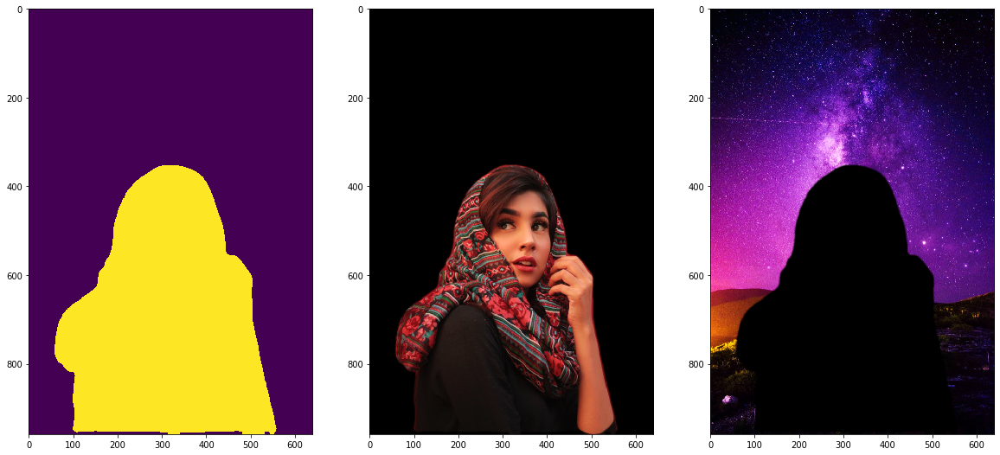

# Semantic Segmentation and Background Separation

| Foreground | Background | Result |
|---|---|---|
|  |  |  |

## Segmentation Result

## Applications

| Result | Blurred | Grayscale |
|---|---|---|
|  |  |  |

## Dependency
- Python 3
- pytorch
- torchvision
- numpy
- Pillow
- matplotlib
- OpenCV